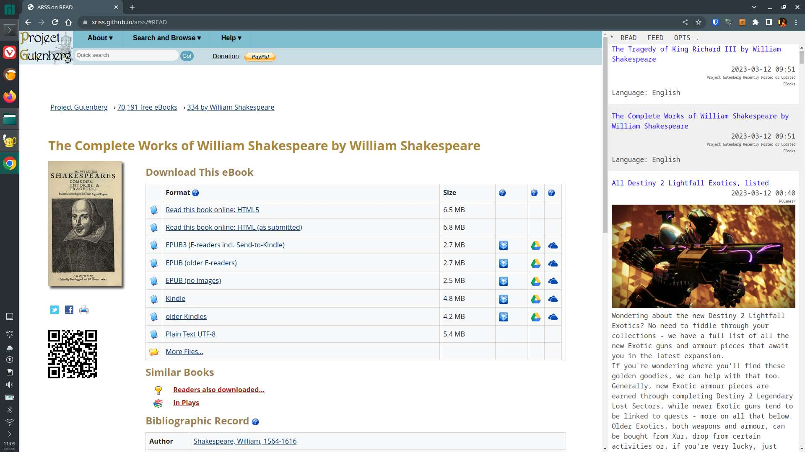

# A RSS reader.

In a browser, less of a book marker app, more of a doom scoller.

To celebrate the ten year deathday of google reader -- "Go back into the water, live there, die there."

We present the RSS published content in a small column whilst *auto*
loading the full page with javascript disabled in an iframe. This works
well with news sites that only publish teaser content then expect you
to visit the full site to keep reading.

This requires some hacks to disable browser security so it can do
naughty things like read other websites from a web page, shock, horror.

Idealy you should install this extension that create a fake CORS
bouncer in the browser which we will automatically use. So no extra
bandwidth cost, very efficient, no bullshit. Technically this is also
secure, although slightly evil.

http://github.com/xriss/security-theater

Note that the above CORS plugin should be installed for
https://xriss.github.io/arss/ to just work.

Another way is to run a special chromium with security disabled like
so.

	chromium --disable-web-security --user-data-dir=~/.arss --allow-running-insecure-content https://xriss.github.io/arss/?cors=false

Which allows everything.

Some options can be passed in the URL for instance if you want to force
the use of a CORS proxy

https://xriss.github.io/arss/?cors=https://cors-anywhere.herokuapp.com/

or maybe force a github token

https://xriss.github.io/arss/?gist=randomsupersecret

or just read an OPML published on the web. This is a good way to use
this app as a reader without connecting to github. I've included
someones ( I just googled and found
https://ruk.ca/content/heres-my-opml ) public OPML file as it makes for
a good demonstration of how this can simply work.

https://xriss.github.io/arss/?idb=delete&opml=https://images.ruk.ca/opml/peter_rukavina_blogroll.opml

If you use a link like this while connected to github without the
idb=delete it will pop up a confirm requester before merging all the
feeds with your own as this would be hard to undo. What that means is
this link will let you read an opml without messing with your personal
options and adding the feeds to your view since the database will be
cleared on startup. Note that it still keeps the data caching so
refreshes of a page should be fast.

If you link directly to an atom/rss feed instead of an opml then we
will pick it up and import just that feed so urls like

	https://xriss.github.io/arss/?idb=delete&opml=http://www.whatsonsteam.com/feed.rss#READ

can be used to auto reed a single feed in isolation.

FYI https://opml.glitch.me/ can be used to scan your twitter followings
and find RSS feeds from peoples sites. I'd recommend prettying up the
output opml file and manually editing it to remove the comment feeds
before importing it.

To read my feed I recomend installing [security-theater](https://github.com/xriss/security-theater) in a chrome like ( https://thorium.rocks/ )
and then visiting
https://xriss.github.io/arss/?idb=delete&opml=https://gist.githubusercontent.com/xriss/1ae83d25d088d102a0b633c3e59d3aa0/raw/4f7ed76a120b328983bb53021997dabc3f7dd9da/arss.opml
Hint: It will take a while to fetch all the feeds so you can click on
read while waiting to view partially downloaded feeds after a few
seconds.
